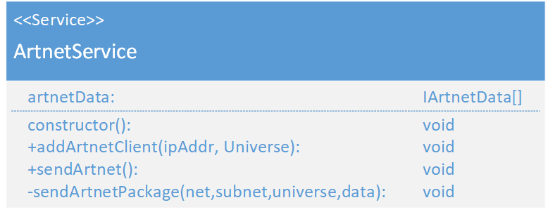

# ArtnetService
(not yet Implemented)  

### Dependencies:  
- [IArtnetData](./IArtnetData.md)

### Description:
The ArtnetService manages the finished DMX data and sends the DMX-Artnet data th the commander. It also manages the connected clients.