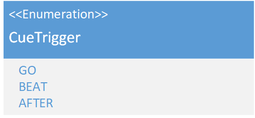

# CueTrigger
(not yet Implemented)  

### Dependencies:  

### Description:
The CueTrigger Enum describes on which Trigger of a [CueList](./Cuelist.md) a [Cue](./Cue.md) will be executed.

|Trigger|Action|
|--|--|
|GO|the Cue gets executed when the user gives the Go command|
|BEAT|the Cue gets executed on a beat|
|AFTER|the Cue gets executed after a time. The time is the triggerImmediate in milliseconds|
