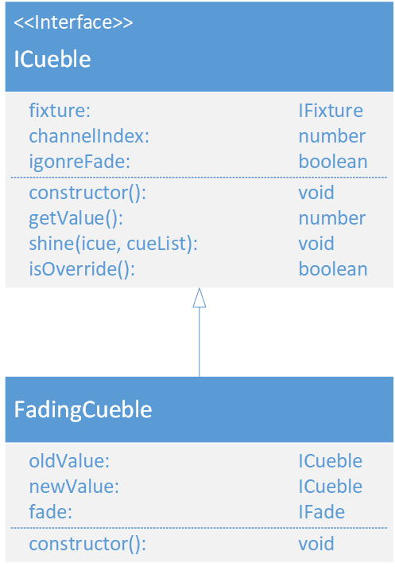

# FadingCueble
\#v3  
(not yet Implemented)  

### Dependencies:  
- [ICueble](./ICueble.md)
- [IFixture](./IFixture.md)
- [ICue](./ICue.md)
- [IFade](./IFade.md)

### Description:
The FadingCueble inherits from the [ICueble](./ICueble.md) interface. It fades between two different cuebles for the same [channel](./Channel.md).
