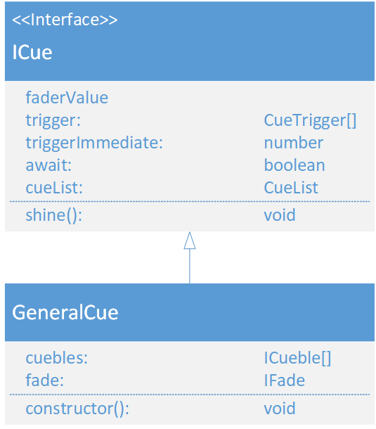

# GeneralCue
(not yet Implemented)  

### Dependencies:  
- [CueTrigger](./CueTrigger.md)
- [CueList](./CueList.md)
- [ICueble](./ICueble.md)
- [IFade](./IFade.md)

### Description:
The General cue inherits from the [ICue](./ICue.md) interface. A GeneralCue is a set of stats of different fixtures. For each stat of a fixture ther is a [Cueble](./Cueble.md). An General Cue also contains an [IFade](./IFade.md) to fade the values of the cue in.
