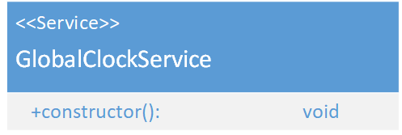

# GlobalClockService
\#v1  
(not yet Implemented)  

### Dependencies:  
- [FixtureService](./FixtureService.md)
- [ArtnetService](./ArtnetService.md)

### Description:
The GlobalClockService triggers the [FixtureService](./FixtureService.md) to fetch its value and the [ArtnetService](./ArtnetService.md) to send the Artnet data when the FixtureService has finished.  
#### Forecast:
The GlobalClockService will trigger timed CueListEvents and Timed Fades.