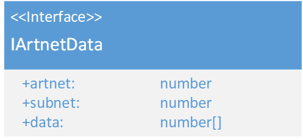

# IArtnetData
\#v1  

### Dependencies:  

### Description:
The IArtnetData Interface sores the information all DMX-channels, the artnet, subnet and DmxUniveres of a ArtnetPackage. The subnet is the high nibble and the universe the low nibble of the subnet attribute.
