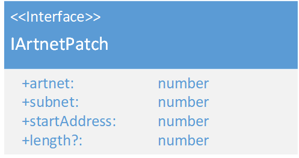

# IArtnetPatch 
\#v1  

### Dependencies:

### Description:
The IArtnetPatch is a mapping of a fixture to its Artnet settings. the subnet value contains the Artnets standatrs subnet and Dmx universe. The high nibble of the byte value is the subnet and the low nibble is the universe.
the length specifys how many chanels the fixture needs.
