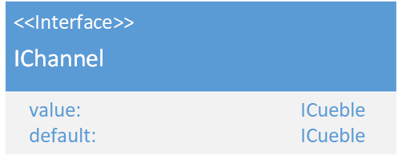

# IChannel
\#v2  

### Dependencies:  
- [ICueble](./ICueble.md)

### Description:
A IChannel represents the input data of a fixture. His vlaue is represented by a [ICuebles](./ICueble.md). The default value is used, to set a value when there is no else one.
