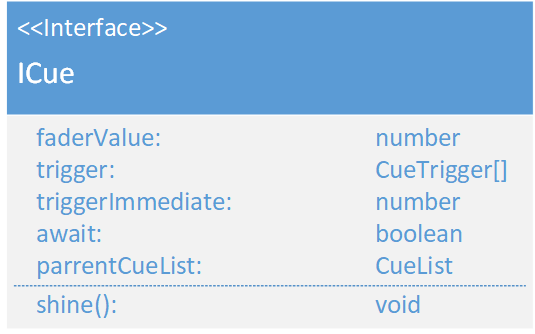

# ICue
\#v2  
(not yet Implemented)  

### Dependencies:  
- [CueTrigger](./CueTrigger.md)
- [CueList](./CueList.md)

### Description:
A Cue is an Action which will be executed. For example a [GeneralCue](./GeneralCue.md) has a set of stats for fixtures. A Cue has triggers, which decides, when the cue will be executed. The await flag describes if the next cue has to wait for the next trigger or can start imerdiantly.