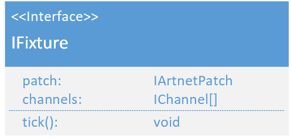

# IFixture
(not yet Implemented)  

### Dependencies:  
- [IArtnetPatch](./IArtnetPatch.md)
- [IChannel](./IChannel.md)

### Description:
An IFixture is the interface for Fixtures. It has multiple input channels and a patch. on the tick event it writes the Dmx data to the [ArtnetService](./ArtnetService.md)