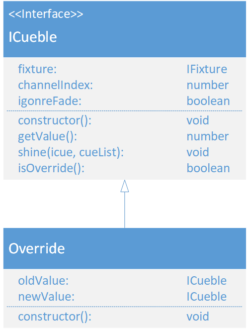

# Override
\#v3  
(not yet Implemented)  

### Dependencies:  
- [IFixture](./IFixture.md)
- [ICueble](./ICueble.md)
- [ICue](./ICue.md)

### Description:
The Override inherits from the [ICueble](./ICueble.md) interface. It overrides an ICueble as an old Value and sets another ICueble as value.