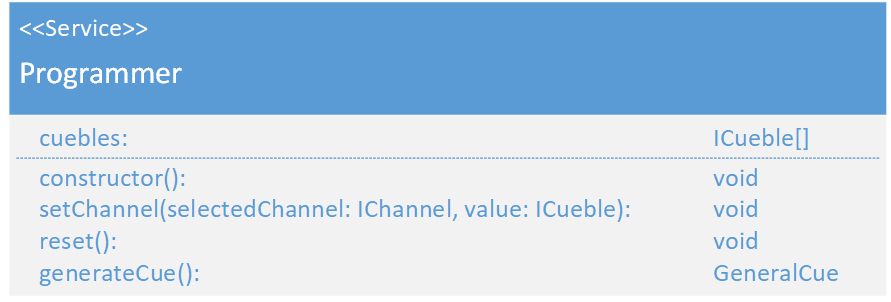
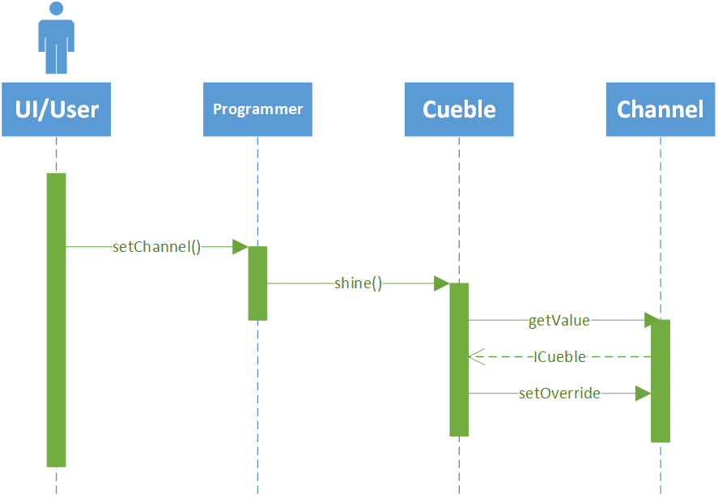

# Programmer
\#V3  
(not yet Implemented)  

### Dependencies:  
- [ICueble](./ICueble.md)
- [GeneralCue](./GeneralCue.md)

### Description:
The Programmer is a service which is responsible for creating cues. When the User wants to create a cue he sets all values in the programmer and when he is done, he can export it as a cue.

