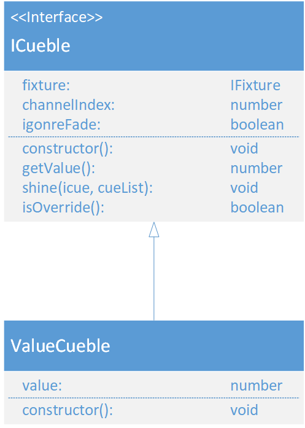

# ValueCueble
(not yet Implemented)  

### Dependencies:  
- [IFixture](./IFixture.md)
- [ICue](./ICue.md)

### Description:
The ValueCueble inherits from the [ICueble](./ICueble.md) interface. It maps a channelIndex from the fixture to an specific value. The fade flag eneables or disables fade for enter this cueble.
